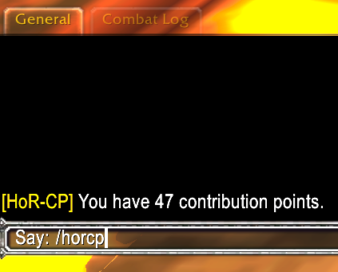
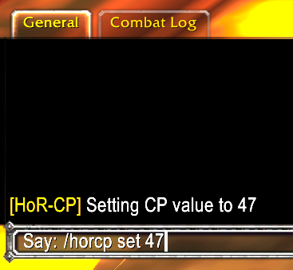
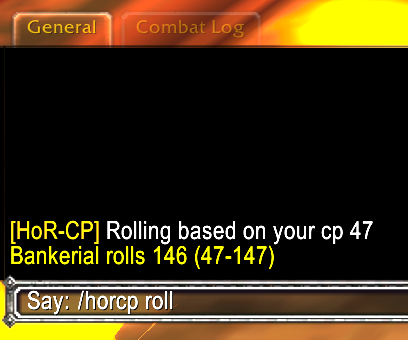
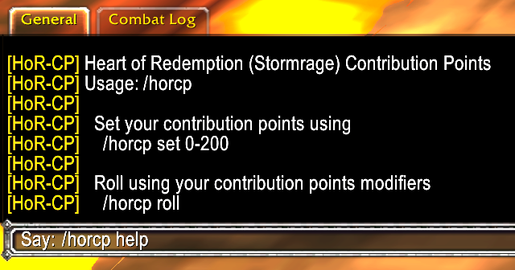

# Heart of Redemption Contribution Points

 Heart of Redemtion is currently using [Version 11](http://www.heartofredemption.info/slayer_images/HoR_CPS_Version_11.pdf) of the Contribution Points loot system. For the most up to date and complete information, please refer to the [official docs]((http://www.heartofredemption.info/slayer_images/HoR_CPS_Version_11.pdf)).

## What This Add-on Does

This addon helps the user easily manage their weekly contribution points and rolls. When the weekly CP list is released, just type `/horcp set #` to set your CP modifier for the week. When it comes time to roll on loot, simply use `/horcp roll` and your CP modifier will automatically be applied to your roll. This works for any type of CP based roll.

## Contribution Points Overview

Contribution Points : Contribution Points, or **“CP,”** refers to the points in HoR’s
loot-system. Like many solid, long-term, flexible systems, the **CP** system has a lot of
thought and design behind it, but it was built and rolled out to be simple to implement
and use once understood. We used the name contribution points due to the system
allowing for points to be earned in a variety of ways besides just strict raid attendance or
boss-kills. In a way, your **CP** shows your overall 'contribution' to HoR's raiding goals
over time. **CP** points are cumulative, so they build up over the course of time you
participate in raiding. This means that **CP** points are not spent when you win loot. The
longer and more consistently you raid with HoR, the more **CP** you will have. Due to
this, we place a cap on **CP** points which alleviates inflation that plagues other systems.

## Loot Roll Types

| Priority | Roll Type | Description |
| --- | --- | --- |
| 1 | CP Need | A Need Roll is used to try and win any equipable upgrade (or side-grade) for your main raiding-spec only. |
| 2 | CP Over-Need | Over-Need (or “ON” for short) is what we call the rolls once a member has used their 1 Need Roll for the week. |
| 3 | CP Off-Spec | Off-Spec Rolls are used for gear that is NOT for your main raiding spec. |
| 4 | CP Alt | Alt’s cannot use CP. Therefore, alts just roll a flat 100 roll, and alt rolls come after all main’s needs. |
| 5 | CP Transmog | If no one wants raid loot, we offer a non-Need roll for collecting Transmog appearances |

## Screenshots

| Command | Screenshot |
| --- | --- |
| `/horcp` |  |
| `/horcp set 47` |  |
| `/horcp roll` |  |
| `/horcp help` |  |

## Helpful Links

* [WoWHead Comprehensive WoW Addon Beginners Guide](https://www.wowhead.com/guide/comprehensive-beginners-guide-for-wow-addon-coding-in-lua-5338)
* [Output Colors](https://www.wowinterface.com/forums/showpost.php?p=336818&postcount=7)
* [WoWlua](https://curseforge.com/wow/addons/wowlua)